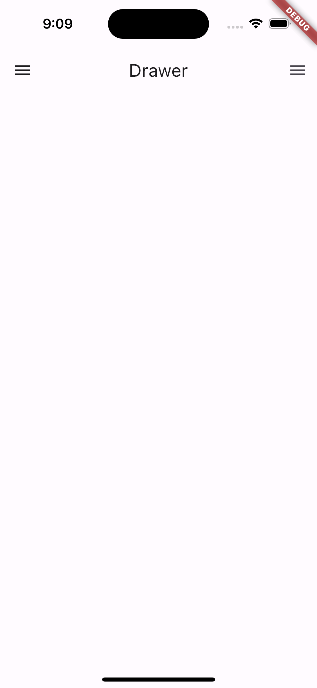

# ch8_drawer_application

In this example, the Drawer is added to the drawer or endDrawer property of the Scaffold.

I also used `"ListView` and `"ListTile` widgets to create the Drawer Content.

## Right Drawer

 

## Left Drawer

 

## Main Drawer

 